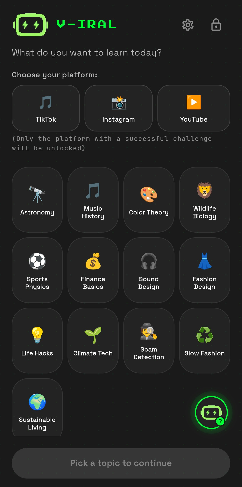

# ElevenLabs voice showcase (Flutter)

Small, **public** demo you can link from a job application: **ElevenLabs Text-to-Speech** with a **contextual help bubble** (speech-bubble overlay + `just_audio` playback) and **SHA256-based disk caching** so identical lines are not billed twice.

This repo is intentionally **narrow**: it highlights the **ElevenLabs integration** inside a real product UI, not the whole codebase.

## V-IRAL (full app — context only)

**V-IRAL** is my Flutter app that combines structured learning with everyday screen habits: users work through short, topic-based challenges and unlock measured screen time on apps they care about. The experience is bilingual (German / English), includes guided onboarding, and is backed by **Flutter** plus **native Android** pieces where the platform requires it (permissions, foreground services, accessibility-related flows, and tight integration with how apps are used on device).

That wider product also uses **generative AI** for content and **design-system-level UI** — but those parts stay **private** so the core idea and implementation details are not fully public.

**If you want to go deeper** (architecture, security model, native bridge, or a short walkthrough of the full app), I’m happy to share more **on request** — for example after an intro call or through the same channel as this application.

*(Optional: add your email or LinkedIn here if you want a direct line in the README.)*

## Screenshots

Add PNGs under [`docs/screenshots/`](docs/screenshots/) — see [`docs/screenshots/README.md`](docs/screenshots/README.md) for exact filenames and a step-by-step capture guide. **Until those files are committed, the `` links below show as broken on GitHub** — capture first, then push.

Once the files exist, the images below render on GitHub.

<p align="center">
  
  &nbsp;&nbsp;
  
</p>

<p align="center">
  
  &nbsp;&nbsp;
  
</p>

**Optional:** short GIF `docs/screenshots/demo-bubble-tap.gif` (tap bubble → overlay → audio). Link it in your application if the form allows GIFs or add a row above with `` after you record it.

## What to highlight in your application

| Piece | File |
|-------|------|
| TTS client, cache keying, error surfacing | `lib/services/eleven_labs_service.dart` |
| Bubble + overlay + comic speech-bubble painter | `lib/widgets/tutorial_bubble.dart` |
| Per-step “seen” flags (SharedPreferences) | `lib/services/tutorial_controller.dart` |
| DE/EN copy + voice script (TTS text) | `lib/demo_strings.dart` |

## Run locally

1. Create an [ElevenLabs API key](https://elevenlabs.io/) (never commit it).

2. From this folder:

   ```bash
   flutter pub get
   flutter run \
     --dart-define=ELEVENLABS_API_KEY=YOUR_KEY_HERE
   ```

3. Optional — different voice per app language (e.g. two Voice-Design voices):

   ```bash
   flutter run \
     --dart-define=ELEVENLABS_API_KEY=YOUR_KEY \
     --dart-define=ELEVENLABS_VOICE_ID_DE=voice_id_for_german \
     --dart-define=ELEVENLABS_VOICE_ID_EN=voice_id_for_english
   ```

4. In the app: use **DE/EN** in the app bar to switch language; tap **refresh** to reset bubbles.

## Publish on GitHub (separate public repo)

You can keep your main app private and publish **only this folder**:

```bash
cd elevenlabs_voice_showcase
git init
git add .
git commit -m "Add ElevenLabs Flutter voice showcase"
# Create an empty repo on GitHub, then:
git remote add origin https://github.com/YOUR_USER/elevenlabs_voice_showcase.git
git branch -M main
git push -u origin main
```

Use that repository URL in the application form.

**If this folder lives inside another Git repo** (e.g. `algo_quest`): add `elevenlabs_voice_showcase/` to that repo’s `.gitignore` so you do not accidentally commit the showcase into the private project — or move/copy this folder elsewhere before `git init`.

## Notes

- Default fallback voice ID is a **premade** voice suitable for free-tier API use; community **library** voices often return HTTP 402 on free plans.
- Model: `eleven_multilingual_v2` — one model for both German and English copy.
- Mascot asset: `assets/brand/mascot-head.png` (bundled for the demo).

## License

Code in this folder is provided as a portfolio sample; add or adjust a `LICENSE` file before publishing if you need explicit legal terms.
