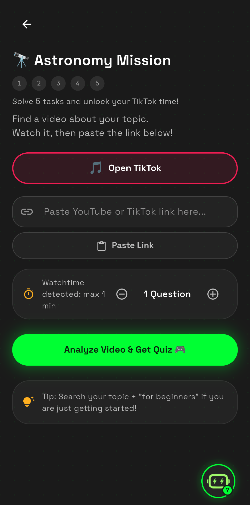
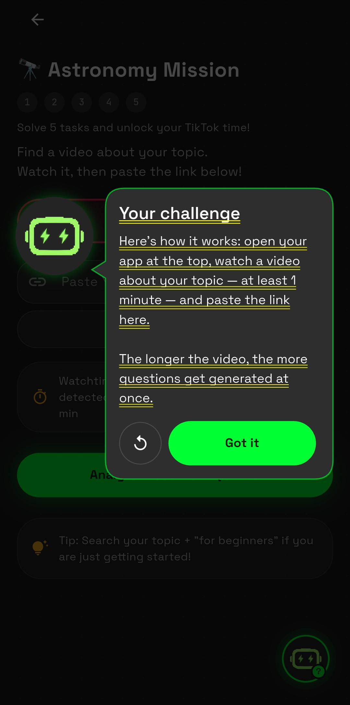

# V-IRAL — ElevenLabs slice (Flutter)

**V-IRAL** is a bilingual Flutter app I’m building: short missions around topics, checks on what you watched, then quizzes and rewards that translate into a bit of screen time in the apps you’re actually trying to use. The full product is Flutter plus native Android where the platform demands it; that larger codebase stays private.

**This repo** is just the **ElevenLabs** part cut out so it’s easy to read on its own. It POSTs to the text-to-speech API (`eleven_multilingual_v2`), saves the MP3, and names the cache file from a SHA-256 hash of the text, voice id, model, and voice settings — same inputs, same file, no second API call. Audio plays through `just_audio`. On top there’s a thin UI: pulsing help bubble, full-screen overlay, hand-drawn speech-bubble shape, German and English strings.

## Screenshots

Left to right: main screen, mission with bubble, mission with overlay open.

<p align="center">
  
  &nbsp;
  
  &nbsp;
  
</p>

## Where the code lives

| What | Path |
|------|------|
| TTS + cache + errors | `lib/services/eleven_labs_service.dart` |
| Bubble, overlay, `CustomPainter` speech bubble | `lib/widgets/tutorial_bubble.dart` |
| Seen flags (SharedPreferences) | `lib/services/tutorial_controller.dart` |
| DE/EN copy + text sent to TTS | `lib/demo_strings.dart` |

## Run

Needs an [ElevenLabs API key](https://elevenlabs.io/) — pass via `--dart-define`, don’t commit it.

```bash
flutter pub get
flutter run --dart-define=ELEVENLABS_API_KEY=YOUR_KEY_HERE
```

Per-language voice IDs (e.g. Voice Design DE / EN):

```bash
flutter run \
  --dart-define=ELEVENLABS_API_KEY=YOUR_KEY \
  --dart-define=ELEVENLABS_VOICE_ID_DE=... \
  --dart-define=ELEVENLABS_VOICE_ID_EN=...
```

In the demo: **DE/EN** in the app bar switches strings (and which env voice id wins); **refresh** clears bubble state.

## Notes

- Default voice if you set nothing is a **premade** ID that tends to work on the free API tier; many **Voice Library** voices return **402** without a paid plan.
- Model: `eleven_multilingual_v2`.
- Mascot: `assets/brand/mascot-head.png`.

## License

No formal license file — treat as a personal code sample unless you add one.
